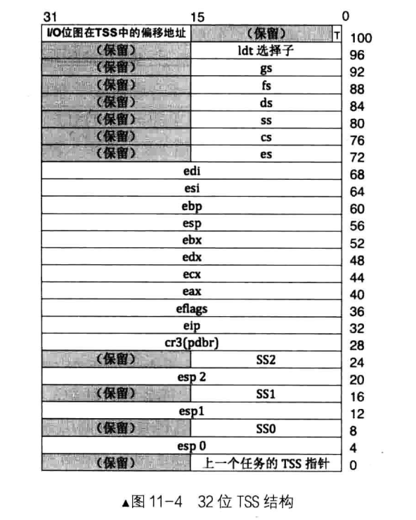
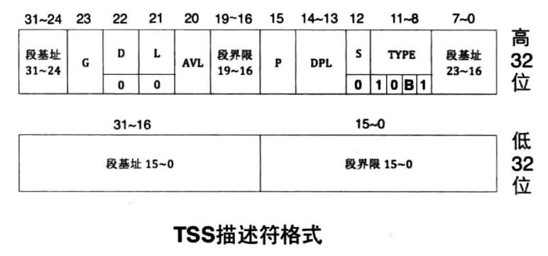
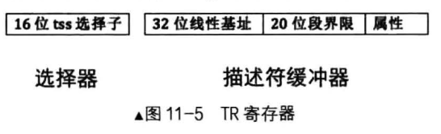

# 用户进程
## tss初始化
**tss**：这里指的是`Task Status Segment `,即任务状态段，位于内存之中，保留的是一个进程所需要的寄存器和运行环境，进程切换的时候使用。下面是一个tss的数据结构图。


**tss描述符** : 因为tss是一个内存数据结构，只要是内存之中的数据都是GDT来寻找，这里的tss描述符包含了权限、基地值、偏移等信息。

**TR**：寄存器，用于保存`tss描述符`在GDT中的选择子，也就是在GDT中的偏移。


寻址方式
*  首先是将GDT加载到gdtr寄存器中
*  然后根据tr的选择子找到GDT中的tss描述符
* 根据描述符找到tss在内存中的地址

用户进程可能会发生从用户空间陷入内核的状态，这里会有特权级的切换，从低特权级到高特权级的转变。当特权级发生变化的时候，比如从3变成0,这个时候需要使用esp0和ss0的栈，以就是说需要使用到tss的ss0和esp0。不同特权级使用的栈空间是不一样的。

`tss`：初始化
* 首先初始化GDT中用户空间的代码段、数据段和TSS描述符
* 定义tss的数据结构和初始化。包含esp0,io位图等。然后重新加载GDT，最后加载TR。注意，这里的io位图没有，当没有的时候io位赋值为tss的大小。当io位图数值>tss大小的时候认为

## 创建用户进程

### 一个小算法: 向上取整数

```c
#define div_round_up(x,step) ((x+step-1) / step)
```
