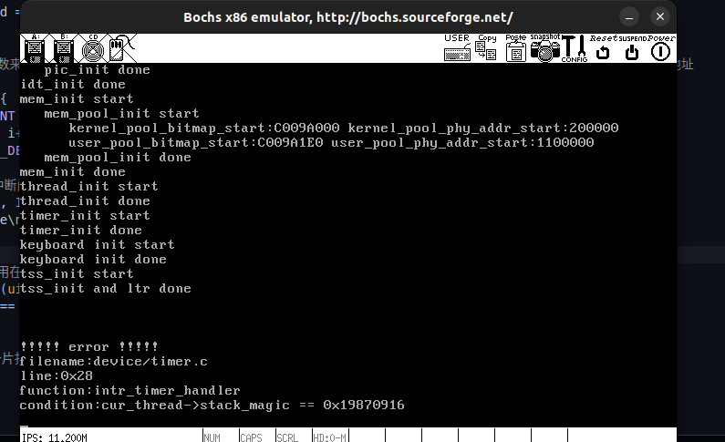

# 完善内核

## 第一部分，实现系统调用
### 小知识

```c
#define _ syscall_return(type, res)\
do {\
    if ((unsigned long) (res) >= (unsigned long) (-1 25 )) { \
        errno =-(res) ;\
        res = -1;\
    }
    return (type) (res);\
}while(0)
```

因为宏定义在展开时会将多行代码合并成一行，而有时候我们希望在宏定义中编写多行代码，且能够像一条普通的语句一样使用。使用 ``do { ... } while (0)`` 的技巧可以实现这一目的。


### “##”表示联结字符串

在C语言中，"##"是称为"预处理器操作符"的符号。它的作用是将两个相邻的字符串连接在一起，形成一个新的字符串。这个过程被称为"字符串联结"或"字符串拼接"。下面是一个简单的示例：

```c
#include <stdio.h>

#define CONCAT(a, b) a##b

int main() {
   int num = 42;
   printf("Number: %d\n", CONCAT(num, 0));  // 输出：Number: 420
   return 0;
}
```

在这个示例中，我们定义了一个宏`CONCAT`，它使用了"##"操作符。当我们调用`CONCAT(num, 0)`时，预处理器会将`num`和`0`连接成一个新的标识符`num0`。最后，`printf`函数将该标识符打印出来，结果为"Number: 420"。


### DEBUG： 线程栈溢出


---
这里主要是由于使用到的pcb更改后，其他已经编译好的程序使用makefile后不会在改变，当修改这个pcb数据结构之后其他的程序也还是不会重新编译。最后导致相同的数据结构在不同的文件中内存显示不一样。
总结：就是makefile编写的规则，当依赖改变时应该要发生改变，这里没有发生改变是因为``没有写全依赖``，从而导致隐形的错误。

### DEBUG：page fault


步骤：  
- 可以看到主进程可以实现获取pid的，因为主线程没有使用中断的机制获取pid，也就是说主进程不需要使用系统调用也可以获取pid。  
- 提示page fault，说明新写的代码寻址错误，不能通过修改过的描述符表找到中断服务程序，所以原因在这里
- 最后原因是没有提供中断服务程序，也就是说没有初始化，将0x80和处理程序没有对应起来。需要添加映射关系，最后的以解决。