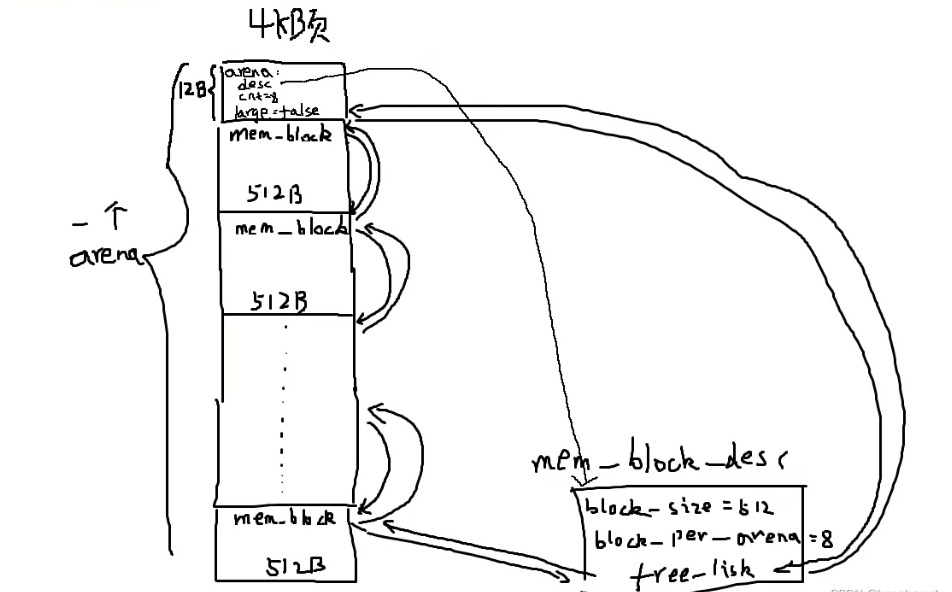

<font face="Yozai">
# 完善内核

## 第一部分，实现系统调用

流程：带补充--->

### 小知识

```
#define _syscall_return(type, res)\
do {\
    if ((unsigned long) (res) >= (unsigned long) (-125 )) { \
        errno =-(res) ;\
        res = -1;\
    }
    return (type) (res);\
}while(0)
```

因为宏定义在展开时会将多行代码合并成一行，而有时候我们希望在宏定义中编写多行代码，且能够像一条普通的语句一样使用。使用 ``do { ... } while (0)`` 的技巧可以实现这一目的。


### “##”表示联结字符串

在C语言中，"##"是称为"预处理器操作符"的符号。它的作用是将两个相邻的字符串连接在一起，形成一个新的字符串。这个过程被称为"字符串联结"或"字符串拼接"。下面是一个简单的示例：

```c
#include <stdio.h>

#define CONCAT(a, b) a##b

int main() {
   int num = 42;
   printf("Number: %d\n", CONCAT(num, 0));  // 输出：Number: 420
   return 0;
}
```

在这个示例中，我们定义了一个宏`CONCAT`，它使用了"##"操作符。当我们调用`CONCAT(num, 0)`时，预处理器会将`num`和`0`连接成一个新的标识符`num0`。最后，`printf`函数将该标识符打印出来，结果为"Number: 420"。


### DEBUG： 线程栈溢出


---
这里主要是由于使用到的pcb更改后，其他已经编译好的程序使用makefile后不会在改变，当修改这个pcb数据结构之后其他的程序也还是不会重新编译。最后导致相同的数据结构在不同的文件中内存显示不一样。
总结：就是makefile编写的规则，当依赖改变时应该要发生改变，这里没有发生改变是因为``没有写全依赖``，从而导致隐形的错误。每次使用``make all``之前都需要先使用``make clean``

### DEBUG：page fault

? 调试细节：待补充

步骤：  
- 可以看到主进程可以实现获取pid的，因为主线程没有使用中断的机制获取pid，也就是说主进程不需要使用系统调用也可以获取pid。  
- 提示page fault，说明新写的代码寻址错误，不能通过修改过的描述符表找到中断服务程序，所以原因在这里
- 最后原因是没有提供中断服务程序，也就是说没有初始化，将0x80和处理程序没有对应起来。需要添加映射关系，最后的以解决。


### 实现sys_malloc
当我们申请一个空间的时候，这个空间大小可以使用16字节、32字节、......1024个字节，多个页框大小来描述。这时这里使用了`arena`来管理更加细致的内存大小。
`arena`:这是一个内存管理的数据结构体，包含两部分，第一部分是元信息，第二部分是内存块。该结构体大小包含1页框和1页框以上的大小，一页框大小为4kb。元信息包括数据块描述。内存块则是元信息后占用的内存空间，一个arena包含`cnt`个同样大小的内存块(mem_block)如何16字节，32字节等。当内存申请大于一个页框时，一个arena则只有一个内存块，需要使用`cnt`描述占用的页框大小。可以使用结构体描述`arena`。

```c
/*内存仓库*/
struct arena{
	struct mem_block_desc* desc;
	uint32_t cnt;
	/*large为true，cnt则表示页框数，否则表示mem_block的数量*/
	bool large;
};
```
`mem_block_desc`：这就是元信息，包含了一个arena的内存块大小，内存块数量以及内存块的链表。同一个内存大小的内存块的arena使用同一个`mem_block_desc`来描述。所以实际上只有（内核+用户内存数据块描述）*7个=14个，大于一个页框的`arena`则不需要使用`mem_blcok_desc`来描述，因为他们每次申请的大小都是不固定的。该结钩体如下所示。

```c
/* 内存块描述符 */
struct mem_block_desc {
   uint32_t block_size;		 // 内存块大小
   uint32_t blocks_per_arena;	 // 本arena中可容纳此mem_block的数量.
   struct list free_list;	 // 目前可用的mem_block链表
};
```
`mem_block_desc`与`arena`的关系如下图所时，这里为小于一个页框4kb的情况。

`具体实现：`
步骤1.创建包含7中基本类型的内存块描述数组，大小为2^4, 2^5, 2^6, 2^7, 2^8, 2^9, 2^10字节。
步骤2.初始化内核和用户内存块描述符数组，分别是7种。
步骤3.实现`sys_malloc`。首先判断是在内核申请还是在用户进程申请。当申请空间大于4kb时，直接申请空间，然后返回该`arena`后的内存块地址。如果申请的空小小于4kb时，首先判断内存规格多大，然后匹配对应的内存块描述数组，当相应的`mem_block_desc`对应的`free_list`没有可用的mem_block时，创建一个新的`arena`，然后根据内存块规格，切割`arene`的内存块空间，切割的每一块新内存块添加到该规格大小的内存块描述数组。最后从`free_list`中弹出空闲的`mem_block`作为申请的空间起始地址，最后将该`arena`可用的内存块数量减去1。
`注意`：这里实际涉及到内存资源的申请访问，所以需要使用锁来同步申请访问内存。

</font>