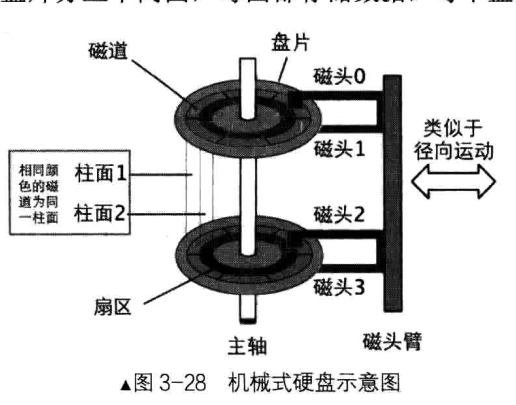

# 硬盘驱动

## 硬盘专业名词解释：
`IDE`:集成设备电路（Integrated Device Electronics，IDE），功能将硬盘和硬盘控制器（硬盘的io接口）整合到一起
`SATA`:硬盘串行接口（Serial ATA，SATA）
`PATA`:并行接口（Parallel ATA，PATA）
`磁道`: 就是盘面上的一个环形，就是一圈扇区
`扇区`:磁道上的一个扇区区域
`柱面`:相同的编号磁道组成的管状区域，不同的盘面中编号位置相同的磁道。
`分区`:是由多个编号连续的柱面组成的。一个柱面只能属于一个分区。

硬盘容量＝单片容量×磁头数。
单片容量＝每磁道扇区数×磁道数× 512 字节。

一般情况下，每磁道扇区数都是 63 ，扇区大小都是 512 ，柱面数和磁头数取决于实际配置的。因此，
在硬盘容量己知的情况下：柱面数×磁头数＝硬盘容量/63/512 .

分区：主分区为了兼容一直保持4个，如果想要新增分区，可以选择主分区中的一个作为扩展分区，扩展分区可以新增逻辑分区。分区表占据64字节，都位于一个扇区mbr中，每个分区占据16个字节。