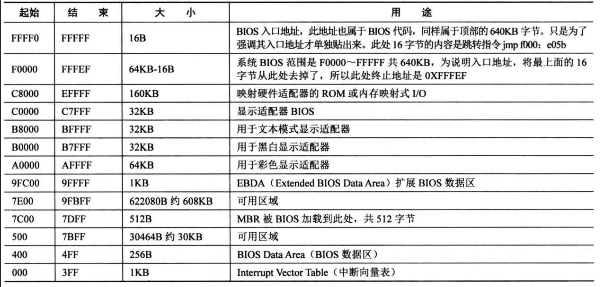

# GDT DESCTOR

# 为什么要分页

因为在保护模式的分段情况下，存在一些断断续续的内存，而为了保持程序在物理地址上的连续性，大于这些片碎片的程序则无法使用加载到内存。但是如果使用程序的线性地址连续，映射到物理地址不连续，那不就是可以加载到内存了吗，碎片的内存也可以得到利用，所以，这种情况下想到了分页

# 一级页表
首先在内存中搜索可用内存，让后存入页表中的页表项中
然后我们使用[0x1234]寻址，首先cpu会识别前20位，然后将20为作为页表项的索引，然后获取cr3的页表地址，相加等于物理页的真实地址，底12位作为物理地址偏移，然后真实地址等于物理页地址+底12位偏移

# 二级页表
一个进程对应一个页表，一个页表需要4MB的空间，多个进程就会占用很多的内存，所以需要引入二级页表，减少内存占用，二级页表可以动态创建二级页表，占用不会大

# 权限

代码段访问代码段，这里需要平级才可以实现，除此之外，可以设置一致性代码段，比如3级代码段访问1级代码段，通过一致性符号就可以设置

q:为什么使用调用门/其他门后，指令通过 jmp选择子+偏移跳转，这里为什么偏移会被忽略

:用户程序传递参数，比如段选择子，段偏移等参数的时候，调用了系统的函数，比如memcpy，然后用户程序就可以知道内核代码了，从而破坏内核，所以，当操作系统发现传递的参数位段选择子之类的，会把参数中的rpl位，改为当前用户的cpl，也就是rpl=3,这样，即使调用了memcpy，但是权限审核仍然过不了，也就不允许运行这样的程序。

调试技巧
该指令可以查看kernel.bin中thread_start的线性地址
>nm build/kernel.bin | grep thread_start

时间断点
* 可以使用 show int/extint 等显示中断以及运行的时间
* 然后记住时间-1
* 然后使用 sba 时间 则会运行到有问题的代码处

# 关于ABI调用

ABI要求主调函数保存esi,edi,ebx,ebp寄存器，有了这几个寄存器，主调函数就可以正常运行，得到保护的环境

然后说一说多线程的switch_to函数，当我们要求切换多线程的时候我们我们需要保护上一个线程的数据。首先push一些必要的数据，最后，在切换前，当前线程的栈保存如下：

然后最后开始运行下一个线程之前首先会把esp指向下一个线程的栈，然后pop 寄存器。首先这里pop的是下一个线程中保存好的esi等数据，然后将这些数据弹出到下一个线程的esi寄存器中，这里我们可以称为恢复环境，只需要恢复这里的四个寄存器，线程就可以接着运行了
这样就完成了上下文的切换过程。注意switch_to切换的是线程，需要遵循ABI的约定，而cdecl是函数调用的约定，这两者不可混为一谈。