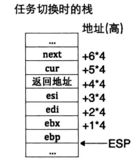

# 关于ABI调用

ABI要求主调函数保存esi,edi,ebx,ebp寄存器，有了这几个寄存器，主调函数就可以正常运行，得到保护的环境

然后说一说多线程的switch_to函数，当我们要求切换多线程的时候我们我们需要保护上一个线程的数据。首先push一些必要的数据，最后，在切换前，当前线程的栈保存如下：

然后最后开始运行下一个线程之前首先会把esp指向下一个线程的栈，然后pop 寄存器。首先这里pop的是下一个线程中保存好的esi等数据，然后将这些数据弹出到下一个线程的esi寄存器中，这里我们可以称为恢复环境，只需要恢复这里的四个寄存器，线程就可以接着运行了
这样就完成了上下文的切换过程。注意switch_to切换的是线程，需要遵循ABI的约定，而cdecl是函数调用的约定，这两者不可混为一谈。